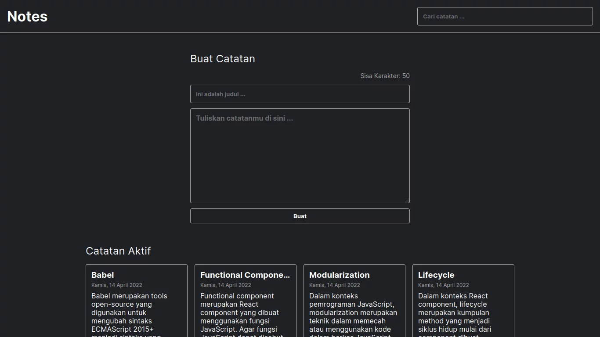

## About Project



Projects about Personal Notes that store data in memory that can be manipulated. This project is the final project of the Dicoding React Beginner class.

### JSON Structure

```JSON
[
  {
    "id": 1654095092040,
    "title": "Example title",
    "body": "Example body",
    "createdAt": "2022-06-01T14:51:53.103Z",
    "archived": false,
  }
]
```

### Built With

[](https://reactjs.org/)

## Getting Started

### Prerequisites

```sh
npm install npm@latest -g
```

### Installation

1. Clone the repo

```sh
git clone https://github.com/herdianurdin/dicoding-react-pemula.git
```

2. Install NPM packages

```sh
npm install
```

## Usage

### Run Project

```sh
npm run start
```

### Build Project

```sh
npm run build
```
